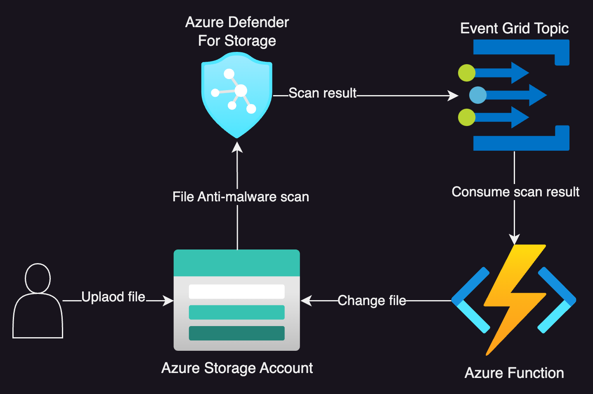

# Azure Anti-Malware File Scanner Solution

This repository provides a complete solution for implementing an Azure Anti-Malware File Scanner using Terraform and Azure Functions. The solution enables anti-malware scanning for files uploaded to the system, automatically handling and processing scan results.

If you enjoy this repo, follow my profile on LinkedIn to stay updated with new articles. [LinkedIn](https://www.linkedin.com/in/karol-pieciukiewicz/)

A detailed description can be found on my blog: [https://azureway.cloud/azure-anti-malware-file-scanner-terraform-net/](https://azureway.cloud/azure-anti-malware-file-scanner-terraform-net/).




## Features

- **Anti-Malware Scanning**: Automatically scans files uploaded to the system for malware.
- **Terraform Infrastructure**: All necessary resources, including containers, Event Grid configurations, and Azure Function setup, are provisioned using Terraform.
- **Automated File Processing**: Depending on the scan results, infected files are moved to a malicious files container, while clean files are moved to a clean files container.
- **Event Grid Integration**: Scan results are published to Azure Event Grid for further processing or alerts.

## How It Works

1. **File Upload**: Files are uploaded to the `unscannedcontent` container.
2. **Scanning**: The Azure Anti-Malware File Scanner scans the uploaded files for malware.
3. **Scan Results**: The scan result can have one of two outcomes:
   - **MaliciousVerdict**: If the file is infected, it will be moved to the `maliciousfiles` container.
   - **CleanVerdict**: If the file is clean, it will be moved to the `cleanfiles` container.
4. **Automation**: The entire process, including the movement of files based on the scan results, is automated via Terraform and Azure Functions.

## Prerequisites

- An active Azure subscription
- Terraform installed on your local machine
- .NET Core SDK for Azure Functions
- Visual Studio Code (optional but recommended for deployment)

## Deployment

### 1. Clone the Repository

```bash
git clone https://github.com/azure-way/azure-malware-scanner.git
cd azure-malware-scanner
```

### 2. Terraform Setup

Ensure that you have Terraform installed and set up before proceeding.

- Initialize Terraform:

```bash
terraform init
```

- Apply the Terraform configuration to create all required resources:

```bash
terraform apply
```

This will create the necessary Azure resources, including the storage account, containers, Event Grid, and the Azure Function.

### 3. Deploy Azure Function

You can deploy the Azure Function in two ways:

1. **Using Visual Studio Code**: You can find a full tutorial on how to deploy an Azure Function [here](https://azure.microsoft.com/en-us/).
2. **Using Azure Pipelines**: Follow the instructions in [my article](https://azureway.cloud/deploy-azure-function-api-management/) to deploy the Azure Function using a CI/CD pipeline.

## Resources Created by Terraform

- Azure Storage Account
- `unscannedcontent`, `maliciousfiles`, and `cleanfiles` containers
- Azure Event Grid Topic
- Azure Function App

## Scan Result Processing

- **MaliciousVerdict**: Files flagged as malicious will be moved to the `maliciousfiles` container.
- **CleanVerdict**: Files deemed clean will be moved to the `cleanfiles` container.
- The scan result is published to Azure Event Grid for further action.

## License

This project is licensed under the MIT License. See the [LICENSE](LICENSE) file for details.
